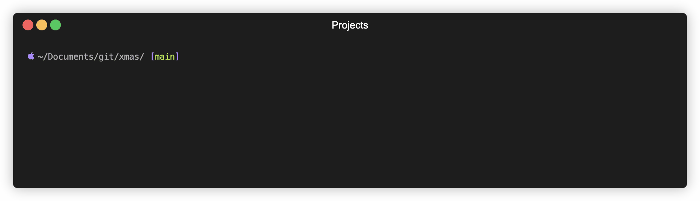

## Uma árvore de natal no seu console

 

### Instalação & execução

1. Clone o repositório

```bash
git clone https://github.com/ortegavan/xmas.git
```

2. Instale as dependências

```bash
cd xmas
npm install
```

3. Execute o script

```bash
node tree
```

4. Enjoy 🎄


